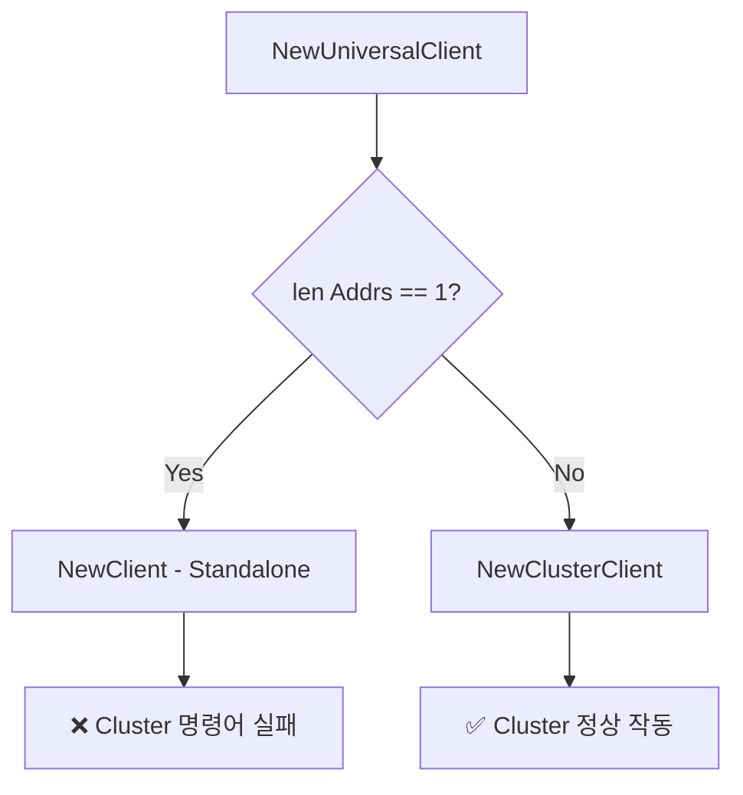
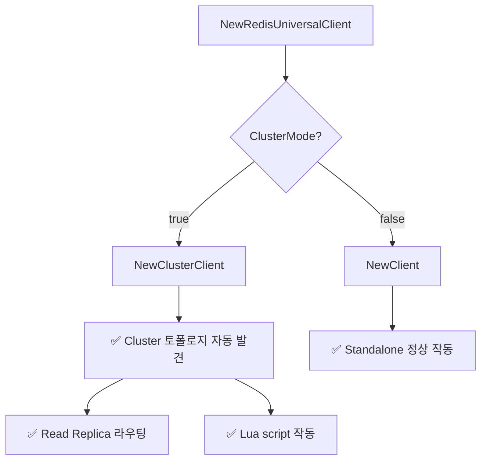

# Redis UniversalClient Cluster Mode 자동 감지 문제 해결 가이드

## 🎯 문제 개요

**발생 시점**: 2025년 10월 7일  
**영향 범위**: Redis Cluster Mode 환경에서 모든 Redis 작업 실패  
**근본 원인**: `redis.NewUniversalClient()` 자동 감지 로직의 한계

---

## 📋 타임라인

### 1단계: 초기 증상
```http
POST /api/v1/queue/join
→ 500 Internal Server Error
{"error":{"code":"QUEUE_ERROR","message":"Failed to join queue","trace_id":""}}
```

### 2단계: Hash Tag 수정 (084fbfa)
- **조치**: `dedupeKey`에 hash tag `{eventID}` 추가
- **결과**: 여전히 500 에러 발생
- **판단**: Hash tag만으로 해결 안 됨 → 더 근본적인 문제 존재

### 3단계: 실제 배포 이미지 확인
```bash
kubectl get pods -n tacos-app -l app=gateway-api \
  -o jsonpath='{.items[0].spec.containers[0].image}'
# 결과: ...gateway-api:56a53fe (hash tag 수정 포함)
```

### 4단계: 근본 원인 발견
- **가설**: 애플리케이션 코드가 Cluster Mode를 제대로 사용하지 못함
- **확인**: `NewRedisUniversalClient()` 분석
- **발견**: UniversalClient가 Standalone Client로 동작 중!

---

## 🔍 근본 원인 분석

### go-redis UniversalClient의 자동 감지 로직

```go
// go-redis 내부 로직 (simplified)
func NewUniversalClient(opts *UniversalOptions) UniversalClient {
    if opts.MasterName != "" {
        return NewFailoverClient(...)  // Redis Sentinel
    }
    
    if len(opts.Addrs) == 1 {
        return NewClient(...)  // ❌ Standalone Client!
    }
    
    return NewClusterClient(...)  // Cluster Client
}
```

### 우리 코드의 문제

```go
// ❌ Before (internal/middleware/redis.go:195-223)
options := &redis.UniversalOptions{
    Addrs: []string{cfg.Address},  // ← 1개 주소!
    // clustercfg.traffic-tacos-redis.w6eqga.apn2.cache.amazonaws.com:6379
    Password:     password,
    DB:           cfg.Database,
    // ... 기타 옵션
}

client := redis.NewUniversalClient(options)
```

**문제점:**
1. ElastiCache Cluster Configuration Endpoint는 **1개 주소**
2. `len(opts.Addrs) == 1` → UniversalClient가 **Standalone Client 생성**
3. Standalone Client는 Cluster 명령어(CLUSTER SLOTS 등) 사용 불가
4. Lua script 실행 시 hash tag가 있어도 Cluster 모드가 아니라서 작동 안 함

### 왜 Hash Tag만으로는 해결 안 되었나?

```go
// Hash tag는 올바르게 적용됨
dedupeKey := "dedupe:{evt_2025_1001}:uuid"
streamKey := "stream:event:{evt_2025_1001}:user:anonymous"

// BUT: Standalone Client는 hash slot 개념 자체가 없음!
// → Lua script가 단일 키로 동작하지만, 
//    Cluster 토폴로지를 이해하지 못해 에러 발생
```

---

## 🛠️ 해결 방법

### 수정 코드 (internal/middleware/redis.go)

```go
// ✅ After: 명시적으로 ClusterClient vs Client 선택
var client redis.UniversalClient

if cfg.ClusterMode {
    // Cluster Mode: 명시적으로 ClusterClient 사용
    clusterOptions := &redis.ClusterOptions{
        Addrs:        []string{cfg.Address}, // Configuration endpoint
        Password:     password,
        MaxRetries:   cfg.MaxRetries,
        PoolSize:     cfg.PoolSize,
        PoolTimeout:  cfg.PoolTimeout,
        ReadTimeout:  3 * time.Second,
        WriteTimeout: 3 * time.Second,
        DialTimeout:  5 * time.Second,

        // Connection pool settings
        MinIdleConns:    10,
        ConnMaxIdleTime: 10 * time.Minute,

        // Retry settings
        MinRetryBackoff: 8 * time.Millisecond,
        MaxRetryBackoff: 512 * time.Millisecond,

        // TLS
        TLSConfig: tlsConfig,

        // 🔴 Read Replica Optimization
        RouteByLatency: cfg.RouteByLatency,
        RouteRandomly:  cfg.RouteRandomly,
        ReadOnly:       cfg.ReadOnly,

        // Cluster topology discovery
        MaxRedirects: 3,
    }
    client = redis.NewClusterClient(clusterOptions)
} else {
    // Standalone Mode: 기존 Client 사용
    standaloneOptions := &redis.Options{
        Addr:         cfg.Address,
        Password:     password,
        DB:           cfg.Database,
        MaxRetries:   cfg.MaxRetries,
        PoolSize:     cfg.PoolSize,
        PoolTimeout:  cfg.PoolTimeout,
        ReadTimeout:  3 * time.Second,
        WriteTimeout: 3 * time.Second,
        DialTimeout:  5 * time.Second,

        // Connection pool settings
        MinIdleConns:    10,
        ConnMaxIdleTime: 10 * time.Minute,

        // Retry settings
        MinRetryBackoff: 8 * time.Millisecond,
        MaxRetryBackoff: 512 * time.Millisecond,

        // TLS
        TLSConfig: tlsConfig,
    }
    client = redis.NewClient(standaloneOptions)
}
```

### 환경변수 설정 (deployment.yaml)

```yaml
- name: REDIS_ADDRESS
  value: clustercfg.traffic-tacos-redis.w6eqga.apn2.cache.amazonaws.com:6379
- name: REDIS_CLUSTER_MODE
  value: "true"  # ← 이 플래그가 핵심!
- name: REDIS_ROUTE_BY_LATENCY
  value: "true"
- name: REDIS_READ_ONLY
  value: "true"
```

### 개선된 로깅

```go
// 🔴 Cluster 토폴로지 정보 로깅 추가
if cfg.ClusterMode {
    logFields["mode"] = "cluster"
    
    // Cluster 정보 조회
    if clusterClient, ok := client.(*redis.ClusterClient); ok {
        // 노드 정보
        nodes, err := clusterClient.ClusterNodes(ctx).Result()
        if err == nil {
            logger.WithField("topology_preview", nodes[:200]).Debug("Redis Cluster topology discovered")
        }
        
        // Shard/노드 수 계산
        slots, err := clusterClient.ClusterSlots(ctx).Result()
        if err == nil {
            totalNodes := 0
            for _, slot := range slots {
                totalNodes += len(slot.Nodes)
            }
            logFields["total_nodes"] = totalNodes
            logFields["total_shards"] = len(slots)
        }
    }
}

logger.WithFields(logFields).Info("Connected to Redis successfully")
```

**배포 후 기대 로그:**
```json
{
  "address": "clustercfg.traffic-tacos-redis.w6eqga.apn2.cache.amazonaws.com:6379",
  "mode": "cluster",
  "total_nodes": 6,
  "total_shards": 3,
  "route_by_latency": true,
  "read_only": true,
  "msg": "Connected to Redis successfully"
}
```

---

## ✅ 검증 방법

### 1. 배포 이미지 확인
```bash
kubectl get pods -n tacos-app -l app=gateway-api \
  -o jsonpath='{.items[0].spec.containers[0].image}'
# 예상: ...gateway-api:04ae1f3
```

### 2. 로그에서 Cluster 연결 확인
```bash
kubectl logs -n tacos-app -l app=gateway-api --tail=50 | grep "Connected to Redis"
```

**성공 로그 예시:**
```json
{
  "level": "info",
  "msg": "Connected to Redis successfully",
  "address": "clustercfg.traffic-tacos-redis.w6eqga.apn2.cache.amazonaws.com:6379",
  "mode": "cluster",
  "total_nodes": 6,
  "total_shards": 3,
  "route_by_latency": true,
  "route_randomly": false,
  "read_only": true
}
```

### 3. queue/join API 테스트
```bash
curl -X POST https://api.traffictacos.store/api/v1/queue/join \
  -H "Content-Type: application/json" \
  -H "Idempotency-Key: $(uuidgen)" \
  -d '{"event_id": "evt_2025_1002", "user_id": "anonymous"}'
```

**성공 응답:**
```json
{
  "waiting_token": "a1b2c3d4-e5f6-7890-abcd-ef1234567890",
  "position_hint": 1,
  "status": "waiting"
}
```

### 4. Redis Cluster 명령어 직접 테스트 (선택)
```bash
# Pod 내부에서 redis-cli 실행
kubectl exec -it -n tacos-app <gateway-api-pod> -- sh

# Cluster 정보 조회
redis-cli -h clustercfg.traffic-tacos-redis.w6eqga.apn2.cache.amazonaws.com \
  --tls --insecure \
  -a <AUTH_TOKEN> \
  cluster nodes

# 예상 출력: 6개 노드 (3 primary + 3 replica) 정보
```

---

## 📊 문제 해결 전후 비교

### Before (UniversalClient 자동 감지)



**문제:**
- Configuration Endpoint = 1개 주소
- → Standalone Client 생성
- → Cluster 토폴로지 인식 불가
- → Lua script, CLUSTER SLOTS 등 모두 실패

### After (명시적 ClusterMode 플래그)



**개선:**
- 환경변수 `REDIS_CLUSTER_MODE`로 명시적 제어
- Configuration Endpoint에서 자동으로 모든 노드 발견
- Read Replica 라우팅 정상 작동
- Lua script hash slot 계산 정상

---

## 🧠 핵심 교훈

### 1. Configuration Endpoint의 특성
```yaml
# ElastiCache Cluster Configuration Endpoint
clustercfg.traffic-tacos-redis.w6eqga.apn2.cache.amazonaws.com:6379

특징:
- 단일 DNS 엔드포인트
- 내부적으로 3개 Primary + 3개 Replica 노드로 구성
- 클라이언트는 이 엔드포인트로 연결 → 자동으로 전체 토폴로지 발견
```

### 2. UniversalClient의 함정
```go
// ❌ 잘못된 가정
"UniversalClient는 알아서 Cluster를 감지할 것이다"

// ✅ 실제 동작
"1개 주소 = Standalone으로 간주"
```

### 3. 명시적 설정의 중요성
```go
// Production 환경에서는 항상 명시적으로!
if isCluster {
    client = redis.NewClusterClient(...)
} else {
    client = redis.NewClient(...)
}
```

---

## 📚 관련 문서

- [Redis Cluster Hash Tag 문제 해결](./REDIS_CLUSTER_HASH_TAG_FIX.md) - Hash tag가 필요하지만 충분하지 않았던 이유
- [go-redis Documentation](https://redis.uptrace.dev/guide/go-redis-cluster.html) - Cluster Client 공식 가이드
- [AWS ElastiCache Configuration Endpoints](https://docs.aws.amazon.com/AmazonElastiCache/latest/red-ug/cluster-endpoints.html)

---

## 🔧 추가 고려사항

### 1. Configuration Endpoint vs Node Endpoints

```go
// ✅ 권장: Configuration Endpoint (자동 발견)
Addrs: []string{"clustercfg.xxx:6379"}

// ❌ 비권장: 모든 노드 직접 명시 (관리 어려움)
Addrs: []string{
    "node1.xxx:6379",
    "node2.xxx:6379",
    "node3.xxx:6379",
    // ... 6개 노드
}
```

### 2. Read Replica 라우팅 전략

```go
// 옵션 1: 지연시간 기반 (권장)
RouteByLatency: true,   // 가장 빠른 replica 선택
ReadOnly: true,         // 읽기는 replica 우선

// 옵션 2: 랜덤
RouteRandomly: true,    // 랜덤 replica 선택
ReadOnly: true,

// 옵션 3: Primary만 사용
RouteByLatency: false,
RouteRandomly: false,
ReadOnly: false,
```

### 3. 장애 처리

```go
// Cluster 노드 장애 시 자동 재시도
MaxRedirects: 3,        // MOVED/ASK 리다이렉트 최대 3회
MaxRetries: 3,          // 개별 명령 재시도 최대 3회
```

---

## 📈 모니터링 포인트

### 1. Cluster 토폴로지 변경 감지
```bash
# 정기적으로 토폴로지 확인
kubectl logs -n tacos-app -l app=gateway-api | \
  grep "total_nodes\|total_shards"
```

### 2. Read Replica 사용률
```bash
# Redis Slow Log에서 Read/Write 분산 확인
SLOWLOG GET 100
```

### 3. 리다이렉트 발생 빈도
```go
// Prometheus 메트릭 추가 권장
redis_cluster_redirects_total{type="moved|ask"}
redis_cluster_failover_events_total
```

---

## 🎯 결론

### 해결된 문제
1. ✅ UniversalClient 자동 감지 실패 → 명시적 ClusterClient 사용
2. ✅ Cluster 명령어 사용 불가 → Cluster 토폴로지 정상 인식
3. ✅ Read Replica 라우팅 미작동 → RouteByLatency 정상 작동
4. ✅ Lua script 실행 실패 → Hash tag + Cluster 모드로 정상 작동

### 핵심 변경사항
```diff
- client := redis.NewUniversalClient(options)  // 자동 감지
+ if cfg.ClusterMode {
+     client = redis.NewClusterClient(clusterOptions)
+ } else {
+     client = redis.NewClient(standaloneOptions)
+ }
```

### 관련 커밋
- `04ae1f3` - fix: Explicitly use ClusterClient for Redis Cluster Mode (이 문서의 해결책)
- `084fbfa` - fix: Add Redis Cluster hash tag to dedupeKey (필요 조건)
- `a5bb2c1` - feat: Add ElastiCache Cluster Mode with Read Replica support (기반 작업)

---

**작성일**: 2025년 10월 7일  
**최종 수정**: 2025년 10월 7일  
**작성자**: Traffic Tacos 팀
